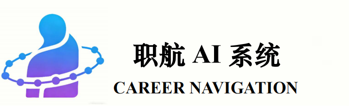

        

 The 17th China University Student Service Outsourcing Innovation and Entrepreneurship Competition

**Work:** A Smart Career Planning System Driven by Multimodal AI《基于多模态大模型驱动的智慧职业规划系统》

**Track:** 【A13】基于AI的大学生职业规划智能体

**Introduction to the work:** Our team has developed a data-driven career planning system based on multimodal large models, and ingeniously created a multi-source, multimodal, multi-dimensional, multi-scale, and multi-module comprehensive intelligent career guidance and decision support system. Aim to fill the gaps in traditional career planning services, provide personalized career analysis and intelligent consulting services for college students, career seekers, and educational institutions, build an intelligent and humane career development service system, and achieve efficient career guidance and talent development.

**The content included in this project:**

1. Integrates five core modules: multi-channel personal information collection, 12-dimensional competency portrait assessment, job intelligence mapping, intelligent person-position matching, and customized career planning, to build a full-link digital career planning system.
2. Leverages technologies such as Qwen large model, RAG knowledge base, and graph neural networks to achieve career path deduction, quantitative analysis of competency gaps, and precise identification of user strengths and weaknesses.
3. Equipped with two practical training tools: AI consulting assistant and digital human simulation interview, providing one-stop services for career Q&A, resume parsing, and simulated interviews.
